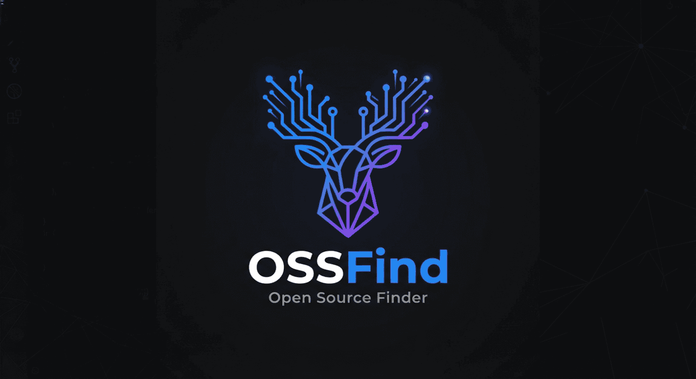

# ossfind 

# OSSFIND

  

## About OSSFIND

OSSIND is a free and open-source platform designed to help developers discover open-source projects, find beginner-friendly issues, track contributions, build portfolios, and grow within the open-source ecosystem.

##  Vision

To make open-source contribution easier, more accessible, and rewarding for everyone.

##  Planned Features

- Good First Issue Finder
- Open Source Project Discovery
- Contributor Portfolio Builder
- Contribution Certificate Generator
- Team Matching for Projects
- Contributor Leaderboards
- Desktop Application

## Who is OSSFIND for?

- Students
- First-time Contributors
- Open Source Maintainers
- Developers
- Tech Communities

## Community

Join discussions, suggest features, and help improve OSSFIND.

Every contribution matters.

## Contributors ⭐

Thanks to everyone who helps improve ossfind!

## Why OSSFIND?

Many developers want to contribute to open source but struggle to find projects, issues, mentors, and opportunities.

OSSFIND aims to bridge that gap by providing tools that make open-source contribution easier and more accessible.

## Support

⭐ Star this repo if you find it useful!
License
MIT License - see LICENSE for details.

Author
Nivaas V - @nivaas219 : https://github.com/nivaas219
